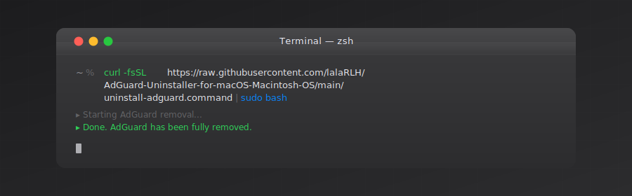

**A personal script for fully removing AdGuard from macOS.**  
Shared publicly in case it saves someone else the time. Nothing more.

</div>

<br/>


## Usage

<br/>

### Within macOS terminal &nbsp;·&nbsp; One-liner (recommended)

No download. No Gatekeeper warning. Paste into Terminal and go.

```bash
sudo bash <(curl -fsSL https://raw.githubusercontent.com/lalaRLH/AdGuard-Uninstaller-for-macOS-Macintosh-OS/main/adguard-manager.sh)
```

<br/>

<div align="center">



<br/>


<br/>

---

## Disclaimer

> This script is provided **"as is"** without warranty of any kind. The author accepts no responsibility for data loss, system damage or any other consequence arising from its use. It runs with administrator privileges and removes files permanently. **Review it before running it. Use entirely at your own risk.**

---

<div align="center">

<sub>Personal hobby script · No support · No warranty · Not affiliated with AdGuard</sub>

</div>
